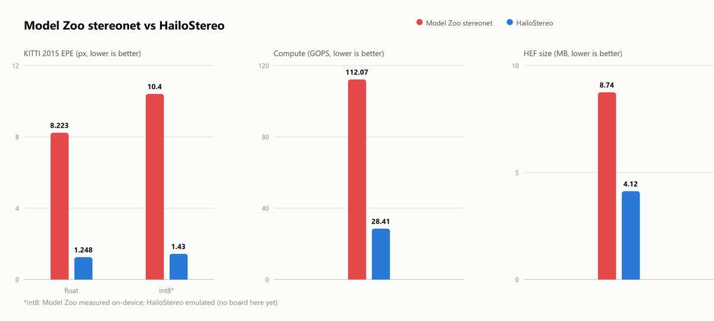
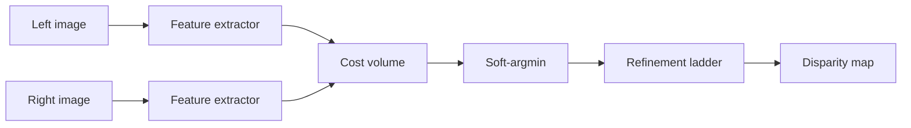
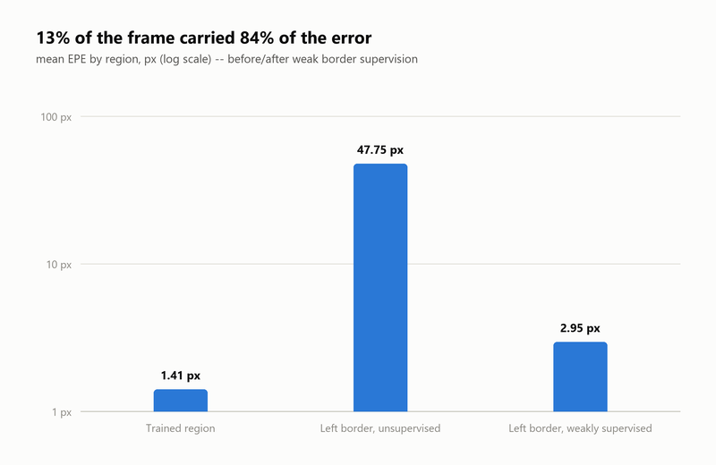
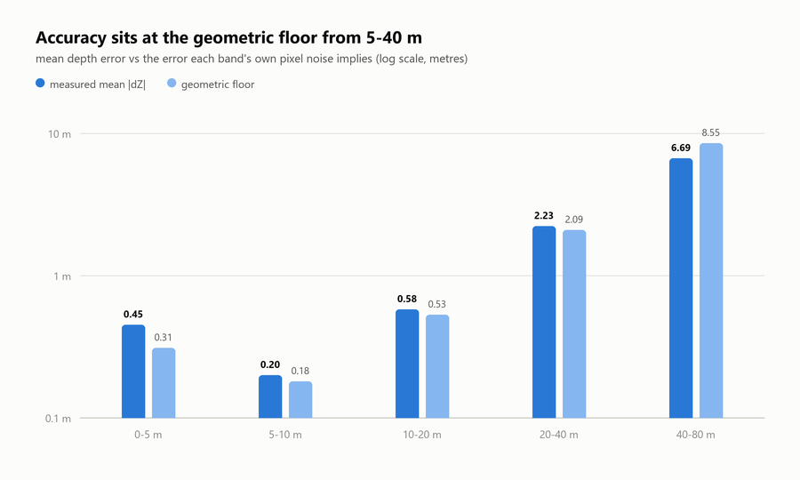
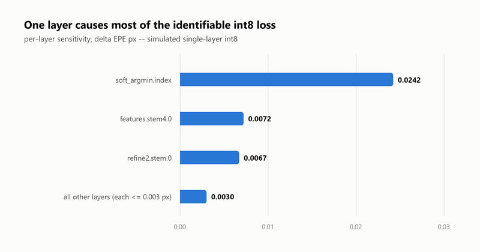

# HailoStereo

A ground-up replacement for the Hailo Model Zoo `stereonet` entry, targeting **Hailo-15H**.

**Status:** trained, exported, quantized, compiled to HEF. Blocked only on
on-device validation — no Hailo board on this machine.

The original was reverse-engineered first — full writeup in
[report/teardown.html](report/teardown.html). Headline finding: its cost
volume pads by `d` then slices `[:W]` instead of `[d:d+W]`, so all **12
disparity hypotheses are bit-identical**. It performs no stereo matching —
its 8.22 px KITTI score comes from learning a left-to-right brightness
gradient, which most road scenes already are. Every design decision below
traces back to a defect ID from that report.

---

## 1 · The headline numbers



Compute is 3.9× lower with *twice* the disparity hypotheses (24 vs 12), and
the softmax is 32× narrower despite having 2× the channels. The int8 figures
are on different footing — Model Zoo's is on-device, HailoStereo's is
DFC-emulated — but the emulator reproduces PyTorch to three decimals (§4), so
the gap is unlikely to be an artefact.

### Architecture



The cost head's final **BatchNorm is load-bearing**. Remove it and the
softmax saturates (entropy 0.007 of a possible 3.18), matching stops
learning, and the model locks onto whatever hypothesis it picked first —
three seeds gave EPE 29.19 / 8.55 / 7.41. With it: entropy 2.56–2.84, EPE
7.47 / 7.22 / 7.82. Folds into the convolution at export, free on device.
Same defect class as NUM-1 in the original — an unscaled softmax — arrived
at from the other direction.

### Structural scorecard

| | Model Zoo `stereonet` | HailoStereo |
|---|---|---|
| Disparity hypotheses | 12 (all identical) | **24 (all distinct)** |
| 3D convolutions | 5 | **0** |
| Softmax width | 5,441,536 elements | **170,016** |
| Largest constant | 21.76 MB (index ramp) | **0.442 MB** |
| Parameters | 423,586 | 796,531 |
| ONNX size | 23.69 MB | **3.38 MB** |
| **Matching actually works** | **no** | **yes** — verified geometrically |

---

## 2 · Accuracy that survives two checks

Training masks two regions from the loss: GT beyond 192 px, and the left
`max_disp` columns, whose matches lie outside the right image. Excluding
them from the *loss* is correct; excluding them from the *reported metric*
is a different claim — this project made that mistake once and fixed it.



The border re-entered the loss at reduced weight rather than staying
unsupervised, cutting its error 16× for a 3.5% cost in the matched region.
`src/eval_kitti.py` reports both protocols in one pass; always quote the
**official** one (1.248 px) against a published baseline, not the masked
number training optimises (1.156 px).



One pixel of disparity error is 6 cm at 5 m and 6.5 m at 50 m — a 100×
difference a single headline EPE hides. "Geometric floor" is the metre error
each band's *own* pixel error implies; 5–40 m sits at it, so sensor geometry
— not the model — is the limit there. 0–5 m is still the weakest band (was
never limited by the 192 px ceiling; the real cause was under-represented
large disparities, since improved with KITTI 2012). Known unscored gap:
above the horizon the model drifts toward "sky is near" — no LiDAR reaches
there to supervise or measure it either.

**A methodology note worth keeping:** every checkpoint before
`sceneflow_holdout` validated on the last 2% of an index-sorted frame list —
adjacent frames of the *same* continuous SceneFlow fly-through in both train
and val. That leak was worth **42%** (2.596 px leaky vs 3.687 px on a
scene-disjoint hold-out) and required a full retrain to fix, since re-scoring
would have leaked through the weights instead of the split.

---

## 3 · Deployment

`artifacts/hailo_stereo_hailo15h.hef` — **4.12 MB, 7 contexts, 5 m 52 s**,
built with `performance_param(compiler_optimization_level=0)`.

| context | EPE masked | EPE official | D1 official |
|---|---|---|---|
| torch float (reference) | 1.156 px | 1.248 px | 6.87% |
| `SDK_NATIVE` | **1.156 px** | **1.248 px** | **6.87%** |
| `SDK_FP_OPTIMIZED` | **1.156 px** | **1.248 px** | **6.87%** |
| `SDK_QUANTIZED` (int8) | 1.333 px | 1.430 px | 8.00% |

Both float contexts reproduce PyTorch **exactly** — the ONNX translation,
on-chip normalization, and NHWC layout are all correct before quantization
is even considered. int8 costs +14.5% official against the +24.6%
`quantize_sim.py` predicted: DFC 5.4.0 runs quantization-aware fine-tuning
at `optimization_level=2`, not the equalization/bias-correction the
simulation modelled.



`soft_argmin.index`'s weights *are* the disparity indices `[0..23]`, so int8
rounding there is a direct metric error, not a feature perturbation — hence
the 16-bit promotion in `deploy/hailo_stereo.alls`. Per-layer deltas sum to
~0.05 px against the 0.36 px the full graph loses in simulation, so most of
the damage is cumulative; promoting the top layer helps but doesn't close
the gap alone (QAT did, in the event).

**Known DFC 5.4.0 bug, not a model defect:** `hailo profiler` crashes on
this HEF (`conv_output_shape` mismatch from spatial-defusing a residual
add). Every allocation this graph admits gets defused the same way, so FPS
is currently unmeasurable with this toolchain — needs on-device timing via
HailoRT instead. The higher-density `max_utilization=0.95` build that
shipped first (4.69 MB, 5 contexts) stopped completing on 2026-09-16 (three
runs of 41–88 min stalled on `shmifo capacity exceeded`); kept at
`artifacts/shipped/` for reference.

---

## 4 · Verification

| check | command | result |
|---|---|---|
| Geometry | `test_disparity.py` | **6/6 pass** — the test the original model fails |
| Ingest | `check_ingest.py` | **PASS** — warping 3.61× better than not warping |
| Synthetic learning | `test_learns.py --steps 2000` | EPE **28.10 → 2.88 px** |
| ONNX structural audit | `export_onnx.py` | **all PASS**, fails closed on any unresolved value |
| ONNX/PyTorch parity | same | **8.4e-04 px** |
| Depth cross-check | `eval_depth.py` | reproduces `eval_kitti.py` to the pixel |
| DFC harness | `deploy/dfc_flow.py` | reproduces `eval_kitti.py` exactly, pre-compile |

The parity check exists because the audit is structural, not semantic:
`fuse_temperature_()` rewrites the cost head's BatchNorm scale by `−t`, and a
sign error there yields a graph that passes every structural check while
computing the **argmax** of the cost volume — the worst match instead of the
best.

---

## 5 · Reproduce every number here

Fastest first; each command prints its own pass/fail. All prefixed
`.venv/Scripts/python.exe src/<file>` on Windows, or the Linux venv in
[Environment](#environment).

| step | command | expect |
|---|---|---|
| Geometry | `test_disparity.py` | 6/6 pass |
| Ingest | `check_ingest.py --dataset kitti --root data/kitti2015/training` | PASS, ×1.0 optimum |
| Accuracy | `eval_kitti.py --ckpt runs/kitti_mixed_fixed768/best.pt --root data/kitti2015/training --bins` | 1.156 masked / 1.248 official px |
| Depth by range | `eval_depth.py --ckpt runs/kitti_mixed_fixed768/best.pt --root data/kitti2015/training` | banded table, §2 |
| Visual check | `preview.py --ckpt runs/kitti_mixed_fixed768/best.pt --dataset kitti --root data/kitti2015/training --n 4 --out artifacts/preview_kitti.png` | shared colour-scale PNG |
| ONNX export + audit | `export_onnx.py --ckpt runs/kitti_mixed_fixed768/best.pt` | 6/6 audits PASS, parity ~1e-4 px |
| Quantization estimate | `quantize_sim.py --ckpt runs/kitti_mixed_fixed768/best.pt --dataset kitti --root data/kitti2015/training --val-limit 40 --calib 24` | +24.2% (add `--sensitivity` for the ranking) |
| Interactive inspector | `demo_server.py --ckpt runs/kitti_mixed_fixed768/best.pt` → `localhost:8000` | 13-panel stage breakdown |

Deploy pipeline (Linux only — DFC is not available on Windows):

```bash
./deploy/hailo-py deploy/dfc_flow.py parse       # → build/hailo_stereo.har
./deploy/hailo-py deploy/dfc_flow.py optimize    # QAT fine-tune, ~6 min
./deploy/hailo-py deploy/dfc_flow.py emulate     # fp_optimized + quantized
./deploy/hailo-py deploy/dfc_flow.py compile --compiler-effort 0   # → 4.12 MB HEF
```

Not `dfc_flow.py all` or bare `compile` — both default to `--max-util 0.95`,
which no longer completes (§3).

The **demo inspector** is the fastest way to see the defect fixed: four
`P(disparity = 0/64/128/184 px)` panels that, in the original, would all be
identical copies. Here they light up different surfaces at different depths.

---

## Data & training

- **SceneFlow Driving** — `src/fetch_driving.py --root data/driving`, resumable, 4,400 pairs (~3.1 GB).
- **KITTI 2015 + 2012** — manual download, [registration required](http://www.cvlibs.net/datasets/kitti/) (CC BY-NC-SA, non-commercial), ~2 GB each, 200 + 194 pairs.

```bash
# Pretrain
python src/train.py --dataset sceneflow --root data/driving --epochs 30 --batch 16 --workers 8

# Finetune (KITTI 2015 + 2012 combined)
python src/train.py --dataset kitti_mixed --root <kitti_root> \
    --init runs/sceneflow_fixed/best.pt --epochs 300 --lr 1e-4

# Resume an interrupted run
python src/train.py --dataset sceneflow --root data/driving \
    --resume runs/sceneflow_full/last.pt --epochs 30 --batch 16
```

- `--init` loads **strictly** — the original used `strict=False` and silently
  left mismatched tensors random (defect EXP-1).
- `--resume` restores optimizer/LR-schedule/AMP state; `--init` starts a new
  schedule from pretrained weights.
- ~100 W draw on this laptop, net-discharging even on mains; a full
  pretrain+finetune cycle is 150–200 Wh. Batch 16 / 8 workers saturates
  throughput (~96 pairs/s, ~60 s/epoch on Driving).

---

## Layout

```
src/model.py           the architecture
src/data.py             SceneFlow + KITTI 2015/2012 loaders, masked validity
src/train.py            deep supervision, masked loss, strict --init
src/eval_kitti.py       accuracy under both protocols
src/eval_depth.py       accuracy in metres, banded by range
src/eval_sceneflow.py   SceneFlow hold-out EPE (forgetting metric)
src/export_onnx.py      ONNX export + defect audit + parity check
src/quantize_sim.py     int8 simulation and per-layer sensitivity
src/preview.py          predictions beside ground truth, shared colour scale
src/demo_server.py      stage-by-stage inspector (stdlib only)
src/make_calib.py       calibration set for the Hailo compiler
notes/make_readme_charts.py   regenerates the charts embedded above
deploy/dfc_flow.py      parse → optimize → emulate → compile → profile
deploy/hailo-py         PYTHONPATH-sanitising wrapper for the DFC
report/teardown.html    reverse-engineering report on the original
notes/                  the analysis scripts behind the teardown
artifacts/hailo_stereo_hailo15h.hef   4.12 MB, 7 contexts  ← the deliverable
runs/kitti_mixed_fixed768/best.pt     the shipped checkpoint
```

---

## What's left

| # | item | severity |
|---|---|---|
| 1 | No on-device validation — no Hailo-15H board on this machine | **high** |
| 2 | FPS/latency unmeasured — `hailo profiler` crashes (DFC bug, §3) | **high** |
| 3 | Close-range (0–5 m) accuracy — improving, not architecture-limited | low |
| 4 | Above-horizon drift — unsupervised, unscored, cosmetic | medium |
| 5 | KITTI licence registration outstanding (CC BY-NC-SA, non-commercial) | low |

Everything else — architecture, training, export, quantization, compilation —
is done and measured. Get a Hailo-15H board and items 1–2 become measured
instead of emulated.

### Environment

Ubuntu 22.04 / RTX 4060 for training (torch 2.3.0+cu121, numpy < 2.0); this
Windows checkout for everything else (Python 3.11, torch 2.14+cu126, onnx
**1.16.2** — 1.17+ is blocked by Application Control on `ml_dtypes`). Hailo
Dataflow Compiler **5.4.0**, `--hw-arch hailo15h`, Linux-only. A ROS Humble
`PYTHONPATH` breaks the DFC's pinned numpy/protobuf/tensorflow — use
`deploy/hailo-py`, not a manual `activate`.
