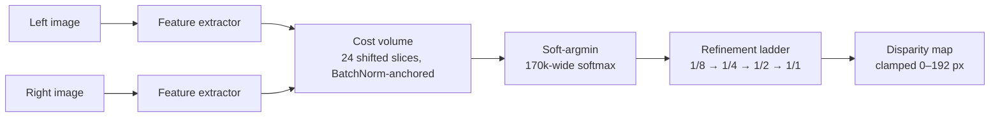

# HailoStereo

A ground-up replacement for the Hailo Model Zoo `stereonet` entry, targeting **Hailo-15H**.

**Status:** trained, exported, quantized, compiled to HEF. Blocked only on
on-device validation — no Hailo board on this machine.

```
6.6×  more accurate (KITTI 2015, official protocol)
3.9×  less compute
2.1×  smaller HEF
1.7×  less accuracy lost to int8
```

---

## The defect

The original was reverse-engineered first — full writeup in
[report/teardown.html](report/teardown.html).

- Its cost volume pads by `d` then slices `[:W]` instead of `[d:d+W]`.
- Result: all **12 disparity hypotheses are bit-identical** `left − right` at zero disparity.
- It performs **no stereo matching**. Its 8.22 px KITTI score comes from learning a left-to-right brightness gradient — most road scenes *are* one.
- 90.6% of its compute sits in a refinement head compensating for a search that never happens.

Every design decision below traces back to a defect ID from that report.

---

## Scorecard

| | Model Zoo `stereonet` | HailoStereo | Δ |
|---|---|---|---|
| **KITTI 2015 EPE, float** | 8.223 px | **1.248 px** | **6.6×** |
| **KITTI 2015 EPE, int8** | 10.4 px (on device) | **1.430 px** (emulated) | **7.3×** |
| Degradation to int8 | +25% | **+14.5%** | 1.7× less loss |
| Compute | 112.07 GOPS | **28.41 GOPS** | 3.9× lower |
| ONNX size | 23.69 MB | **3.38 MB** | 7.0× smaller |
| HEF size | 8.74 MB | **4.12 MB** | 2.1× smaller |
| Disparity hypotheses | 12 (all identical) | **24 (all distinct)** | — |
| 3D convolutions | 5 | **0** | — |
| Softmax width | 5,441,536 elements | **170,016** | 32× narrower |
| Largest constant | 21.76 MB (index ramp) | **0.442 MB** | 49× smaller |
| Parameters | 423,586 | 796,531 | 1.9× more |
| **Matching actually works** | **no** | **yes** — verified geometrically | — |

Compute is 3.9× lower with *twice* the disparity hypotheses, and the softmax
is 32× narrower despite having 2× the channels.

The KITTI figures are the **official protocol** — every pixel with valid
ground truth, including the left border. See [Two protocols](#two-protocols)
below; the masked number training optimises is 1.156 px, and quoting that
against Hailo's 8.223 px would compare different things.

---

## Architecture



One finding worth keeping: the cost head's final **BatchNorm is load-bearing**.
Remove it and the softmax saturates (entropy 0.007 of a possible 3.18),
matching stops learning, and the model locks onto whatever hypothesis it
picked first — three seeds gave EPE 29.19 / 8.55 / 7.41. With it: entropy
2.56–2.84, EPE 7.47 / 7.22 / 7.82. Folds into the convolution at export, free
on device. Reproduced by `notes/diagnose_collapse.py`. Same defect class as
NUM-1 in the original — an unscaled softmax — arrived at from the other
direction.

---

## Verification

| check | command | result |
|---|---|---|
| Geometry | `src/test_disparity.py` | **6/6 pass** — the test the original model fails |
| Ingest | `src/check_ingest.py` | **PASS** — warping 3.61× better than not warping |
| Synthetic learning | `src/test_learns.py --steps 2000` | EPE **28.10 → 2.88 px** |
| ONNX structural audit | `src/export_onnx.py` | **all PASS**, fails closed on any unresolved value |
| ONNX/PyTorch parity | same | **8.4e-04 px** |
| Depth cross-check | `src/eval_depth.py` | reproduces `eval_kitti.py` to the pixel |
| DFC harness | `deploy/dfc_flow.py` | reproduces `eval_kitti.py` exactly pre-compile |

The parity check exists because the audit is structural, not semantic:
`fuse_temperature_()` rewrites the cost head's BatchNorm scale by `−t`, and a
sign error there yields a graph that passes every structural check while
computing the **argmax** of the cost volume — the worst match instead of the
best.

---

## Accuracy in depth

### By distance band

`src/eval_depth.py`, official protocol, `runs/kitti_mixed_fixed768/best.pt`:

| range | AbsRel | δ<1.25 | EPE | geom. floor | note |
|---|---|---|---|---|---|
| 0–5 m | 11.30% | 92.73% | 7.29 px | 0.31 m | weakest band, improving (was 28.4% / 68.2%) |
| 5–10 m | **2.61%** | **99.10%** | 1.20 px | 0.18 m | at the geometric floor |
| 10–20 m | 4.05% | 97.56% | 1.07 px | 0.53 m | at the geometric floor |
| 20–40 m | 7.85% | 93.14% | 1.09 px | 2.09 m | at the geometric floor |
| 40–80 m | 12.23% | 84.05% | 1.16 px | 8.55 m | below floor — convex Z=fB/d, benign |
| **all ≤ 80 m** | **4.53%** | **96.82%** | **1.248 px** | — | headline number |

One pixel of disparity error is 6 cm at 5 m and 6.5 m at 50 m — a 100×
difference the headline EPE alone hides. "Geom. floor" is the metre error the
band's *own* pixel error implies; 5–40 m sits at it, so the sensor geometry —
not the model — is the limit there. Known gap: above the horizon the model
drifts toward "sky is near," unsupervised and unscored by either protocol
(no LiDAR reaches sky).

### The border fix {#two-protocols}

The left `max_disp` columns have no possible match — their correspondence lies
outside the right image. Excluding them from the *loss* is correct;
excluding them from the *reported metric* is a different claim.

| region | share of pixels | mean EPE | share of total error |
|---|---|---|---|
| trained region | 86.8% | 1.41 px | 16.3% |
| left border, unsupervised | 13.2% | **47.75 px** | **83.7%** |
| left border, weakly supervised | 13.2% | **2.95 px** | — |

13% of the frame carried 84% of the error until the border re-entered the
loss at reduced weight — a **16× reduction** for 3.5% cost in the matched
region. `src/eval_kitti.py` reports both protocols in one pass; always quote
the official one against a published baseline.

### The split leak

Every early run validated on the last 2% of an index-sorted list — frames
1–712 of a fly-through in training, 713–800 of *the same* fly-through in
validation. Fixed by holding out whole SceneFlow subsets instead.

| split | val EPE | val D1 |
|---|---|---|
| leaky (adjacent frames) | 2.596 px | 14.88% |
| scene-disjoint (clean) | **3.687 px** | **22.30%** |

**The leak was worth 42%.** Numbers from before this fix are not comparable
to anything after it.

---

## Deployment

### Emulator accuracy

| context | EPE masked | EPE official | D1 official |
|---|---|---|---|
| torch float (reference) | 1.156 px | 1.248 px | 6.87% |
| `SDK_NATIVE` | **1.156 px** | **1.248 px** | **6.87%** |
| `SDK_FP_OPTIMIZED` | **1.156 px** | **1.248 px** | **6.87%** |
| `SDK_QUANTIZED` (int8) | 1.333 px | 1.430 px | 8.00% |

Both float contexts reproduce PyTorch **exactly** — proof the ONNX
translation, on-chip normalization, and NHWC layout are all correct before
quantization is even considered. int8 costs +14.5% official against the
+24.6% `quantize_sim.py` predicted: DFC 5.4.0 runs quantization-aware
fine-tuning at `optimization_level=2`, not the equalization/bias-correction
the simulation modelled.

### Compiling the HEF

`artifacts/hailo_stereo_hailo15h.hef` — **4.12 MB, 7 contexts, 5 m 52 s**,
built with `performance_param(compiler_optimization_level=0)`.

The higher-density `max_utilization=0.95` build that shipped first
(**4.69 MB, 5 contexts**) stopped completing on 2026-09-16 — three runs of
41–88 min stalled on `shmifo capacity exceeded`, the 24-slice cost volume
being expensive to place. Kept at `artifacts/shipped/` for reference.

**Known DFC 5.4.0 bug, not a model defect:** `hailo profiler` crashes on this
HEF (`conv_output_shape` mismatch from spatial defusing a residual add). Every
allocation this graph admits gets defused the same way, so FPS is currently
unmeasurable with this toolchain — needs on-device timing via HailoRT instead.

### Quantization sensitivity

One layer dominates simulated int8 loss:

| layer | Δ EPE |
|---|---|
| `soft_argmin.index` — the `[0..23]` disparity ramp | **+0.0242 px** |
| `features.stem4.0` | +0.0072 px |
| `refine2.stem.0` | +0.0067 px |
| everything else | ≤ 0.003 px |

Its weights *are* the disparity indices, so int8 rounding there is a direct
metric error, not a feature perturbation — hence the 16-bit promotion in
`deploy/hailo_stereo.alls`. Per-layer deltas sum to ~0.05 px against the
0.36 px the full graph loses in simulation, so most of the damage is
cumulative; promoting the top layer helps but doesn't close the gap on its
own (QAT did, in the event).

---

## Reproduce every number here

Fastest first; each command prints its own pass/fail.

| step | command | expect |
|---|---|---|
| Geometry | `test_disparity.py` | 6/6 pass |
| Ingest | `check_ingest.py --dataset kitti --root data/kitti2015/training` | PASS, ×1.0 optimum |
| Accuracy | `eval_kitti.py --ckpt runs/kitti_mixed_fixed768/best.pt --root data/kitti2015/training --bins` | 1.156 masked / 1.248 official px |
| Depth by range | `eval_depth.py --ckpt runs/kitti_mixed_fixed768/best.pt --root data/kitti2015/training` | banded table above |
| Visual check | `preview.py --ckpt runs/kitti_mixed_fixed768/best.pt --dataset kitti --root data/kitti2015/training --n 4 --out artifacts/preview_kitti.png` | shared colour-scale PNG |
| ONNX export + audit | `export_onnx.py --ckpt runs/kitti_mixed_fixed768/best.pt` | 6/6 audits PASS, parity ~1e-4 px |
| Quantization estimate | `quantize_sim.py --ckpt runs/kitti_mixed_fixed768/best.pt --dataset kitti --root data/kitti2015/training --val-limit 40 --calib 24` | +24.2% (add `--sensitivity` for the ranking) |
| Interactive inspector | `demo_server.py --ckpt runs/kitti_mixed_fixed768/best.pt` → `localhost:8000` | 13-panel stage breakdown |

All prefixed `.venv/Scripts/python.exe src/<file>` on Windows, or the Linux
venv shown in [Environment](#environment). On Linux, deploy pipeline:

```bash
./deploy/hailo-py deploy/dfc_flow.py parse       # → build/hailo_stereo.har
./deploy/hailo-py deploy/dfc_flow.py optimize    # QAT fine-tune, ~6 min
./deploy/hailo-py deploy/dfc_flow.py emulate     # fp_optimized + quantized
./deploy/hailo-py deploy/dfc_flow.py compile --compiler-effort 0   # → 4.12 MB HEF
```

Not `dfc_flow.py all` or bare `compile` — both default to `--max-util 0.95`,
which no longer completes (see [Compiling the HEF](#compiling-the-hef)).

The **demo inspector** is the fastest way to see the defect fixed: four
`P(disparity = 0/64/128/184 px)` panels that, in the original, would all be
identical copies. Here they light up different surfaces at different
depths.

---

## Data & training

| dataset | get it | size |
|---|---|---|
| SceneFlow Driving | `src/fetch_driving.py --root data/driving` (resumable) | 4,400 pairs, ~3.1 GB |
| KITTI 2015 | manual, [registration required](http://www.cvlibs.net/datasets/kitti/) | ~2 GB, 200 pairs |
| KITTI 2012 | manual, same registration | ~2 GB, 194 pairs |

```bash
# Pretrain
python src/train.py --dataset sceneflow --root data/driving --epochs 30 --batch 16 --workers 8

# Finetune (KITTI 2015 + 2012 combined)
python src/train.py --dataset kitti_mixed --root <kitti_root> \
    --init runs/sceneflow_fixed/best.pt --epochs 300 --lr 1e-4

# Resume an interrupted run
python src/train.py --dataset sceneflow --root data/driving \
    --resume runs/sceneflow_full/last.pt --epochs 30 --batch 16
```

- `--init` loads **strictly** — the original used `strict=False` and silently
  left mismatched tensors random (defect EXP-1).
- `--resume` restores optimizer/LR-schedule/AMP state; `--init` starts a new
  schedule from pretrained weights. Refused rather than guessed at when
  ambiguous.
- ~100 W draw on this laptop, net-discharging even on mains; a full
  pretrain+finetune cycle is 150–200 Wh. Batch 16 / 8 workers saturates
  throughput (~96 pairs/s, ~60 s/epoch on Driving).

---

## Layout

```
src/model.py           the architecture
src/data.py             SceneFlow + KITTI 2015/2012 loaders, masked validity
src/train.py            deep supervision, masked loss, strict --init
src/eval_kitti.py       accuracy under both protocols
src/eval_depth.py       accuracy in metres, banded by range
src/eval_sceneflow.py   SceneFlow hold-out EPE (forgetting metric)
src/export_onnx.py      ONNX export + defect audit + parity check
src/quantize_sim.py     int8 simulation and per-layer sensitivity
src/preview.py          predictions beside ground truth, shared colour scale
src/demo_server.py      stage-by-stage inspector (stdlib only)
src/make_calib.py       calibration set for the Hailo compiler
deploy/dfc_flow.py      parse → optimize → emulate → compile → profile
deploy/hailo-py         PYTHONPATH-sanitising wrapper for the DFC
report/teardown.html    reverse-engineering report on the original
notes/                  the analysis scripts behind the teardown
artifacts/hailo_stereo_hailo15h.hef   4.12 MB, 7 contexts  ← the deliverable
runs/kitti_mixed_fixed768/best.pt     the shipped checkpoint
```

---

## What's left

| # | item | severity |
|---|---|---|
| 1 | No on-device validation — no Hailo-15H board on this machine | **high** |
| 2 | FPS/latency unmeasured — `hailo profiler` crashes (DFC bug, §[Compiling the HEF](#compiling-the-hef)) | **high** |
| 3 | Close-range (0–5 m) accuracy — improving, not architecture-limited | low |
| 4 | Above-horizon drift — unsupervised, unscored, cosmetic | medium |
| 5 | KITTI licence registration outstanding (CC BY-NC-SA, non-commercial) | low |

Everything else — architecture, training, export, quantization, compilation —
is done and measured. Get a Hailo-15H board and items 1–2 become measured
instead of emulated.

---

## Environment

| | |
|---|---|
| Host (training) | Ubuntu 22.04, x86_64, Python 3.10, RTX 4060 (8 GB) |
| Host (this checkout) | Windows, Python 3.11, torch 2.14+cu126, onnx **1.16.2** (1.17+ blocked by Application Control on `ml_dtypes`) |
| Compiler | Hailo Dataflow Compiler **5.4.0**, `--hw-arch hailo15h`, Linux-only |
| Gotcha | A ROS Humble `PYTHONPATH` breaks the DFC's pinned numpy/protobuf/tensorflow — use `deploy/hailo-py`, not a manual `activate` |
